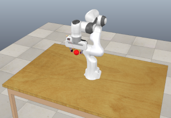

# Robotic Experiment Setup for Collaboration on Robust GAIL project

This repo provides a simulated environment for replicating an RL/Learning-from-Demonstration reaching task on a [Franka Emika Panda](https://www.franka.de/) 7-DOF robot arm.

The "__expert__" system runs in a perfect, noise-free environment, and reaches towards a target sphere using velocites provided by an off-the-shelf IK-solver available in [CoppeliaSim](https://www.coppeliarobotics.com/).

The "__agent__" provides desired velocities for each of the 7 arm-joints at each time step. However, the agent may not run in the same "perfect" environment as the expert, as noise is added to the agent's actions such that the desired and realised joint-velocities may differ.

## Setup

---

1. Download and install CoppeliaSim __VERSION 4.1__ : [(Link for Ubuntu 20)](https://www.coppeliarobotics.com/files/CoppeliaSim_Edu_V4_1_0_Ubuntu20_04.tar.xz)
2. Clone and install [PyRep](https://github.com/stepjam/PyRep). Setup instructions are given [at the repo](https://github.com/stepjam/PyRep), but here's a summary:

	- Clone the repo

			git clone https://github.com/stepjam/PyRep.git
			cd PyRep

	- Add the following to your ~/.bashrc file: (NOTE: the 'EDIT ME' in the first line)

			export COPPELIASIM_ROOT=EDIT/ME/PATH/TO/COPPELIASIM/INSTALL/DIR
			export LD_LIBRARY_PATH=$LD_LIBRARY_PATH:$COPPELIASIM_ROOT
			export QT_QPA_PLATFORM_PLUGIN_PATH=$COPPELIASIM_ROOT

	- Install Dependencies and PyRep itself

			pip3 install -r requirements.txt
			pip3 install .
	
3. Clone this repo, and install the reaching task as an [OpenAI Gym](https://gym.openai.com/docs/) environment:

	    git clone https://github.com/craigiedon/RobustGAILRoboCollab.git
	    cd RobustGAILRoboCollab
	    pip install -r requirements.txt
	    cd gym-reach
	    pip install .

## Usage

---
Run the following command:

		python gym_run_example.py agent_type episode_length num_episodes

Where the parameters are:
- `agent-type` -  Can be either `agent` (run using the RL policy defined in the `Agent` class, with noisy actions) or `expert` (run with an IK solver and perfect noisless actions).
- `episode-length` - the maximum length of an episode (e.g, 200)
- `num-episodes` - is the total number of episodes to run for (e.g., 20)

[comment]: <> (- `--headless` - flag determines whether the simulations are run headless &#40;in the command line without GUI visuals&#41;.)

## Implementing your own RL Agent

---

### The Gym Environments

The reaching task has now been updated to support the [OpenAI Gym](https://gym.openai.com/docs/) environment. Two environments are available:

- `gym.make("gym_reach:reachNoisy-v0", render_mode='rgb_array')` - A noisy environment for agent learning. Desired velocities are subject to gaussian noise with mean=0.1 and variance=0.1
- `gym.make("gym_reach:reachPerfectExp-v0", render_mode='rgb_array')` - A noiseless environment for expert IK control. Control_loop_enabled is set to True here to enable fixed-pathing.

The `render_mode=rgb_array` option adds an rgb camera to the scene facing forward, which allows you to call env.render() and get a 512x512x3 picture of the current state of the world.

### Modifying the Agent

The file `gym_run_example.py` contains a placeholder `Agent()` class. It has the following methods:

- `act(self, state) -> np.ndarray` - Takes in the current state (A (7 + 3)-dimensional vector consisting of the 7 arm-joint positions, and XYZ coordinates of the target object). Outputs a 7-dimensional action (The desired velocities for each joint)
- `learn(self, replay_buffer)` - Takes in a total history (so far) of `(state, action, reward, next_state)` tuples at each time step, and uses them to update the agent's policy

To implement your own agent, sub-class the `Agent` class, and modify the above methods to with your own RL-algorithm.
